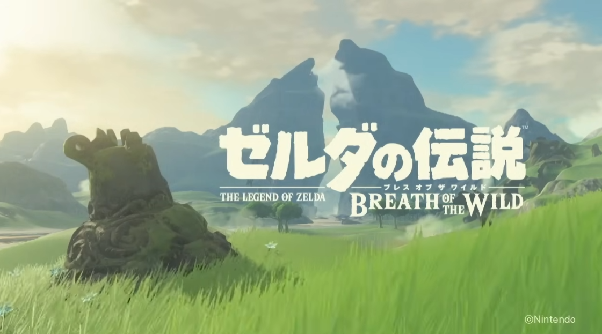
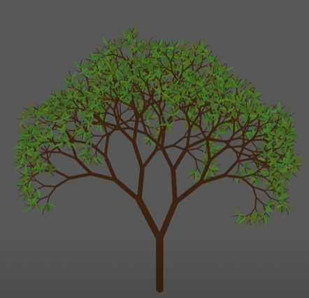
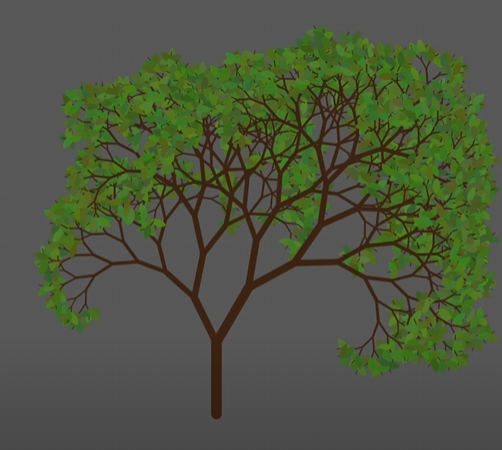
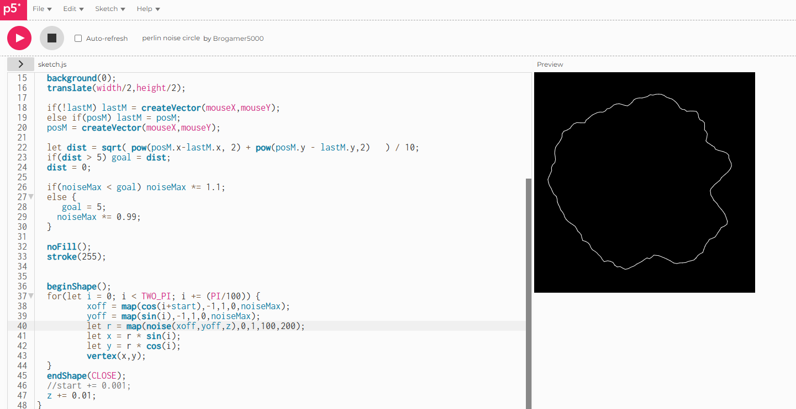
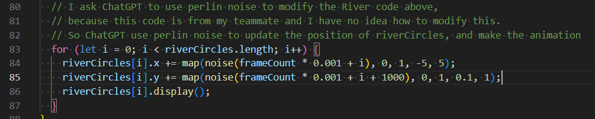

# ylin0904_Final

### 1. Instruction
Load the page and the animation will happen immediately.

### 2. Individual Approach
My personal animation method is Perlin noise.

There are 3 main elements that have been animated through Perlin noise:

First one is the Grass (Green Cylinders). I use Perlin noise to make it move smoother than other teammates

Second one is the River (Blue Circles). I use perlin noise to update the positions of riverCircles, and make the animation smoother than others.

Last one is the Tree. I use Perlin noise to keep changing the size of the tree. The tree will look like it is growing or becoming smaller.

### 3. Inspiration

Nintendo. (2016, June 15). ゼルダの伝説 ブレス オブ ザ ワイルド 1st トレーラー. Youtube. https://youtu.be/GjPidZXIuzs?si=UWlmNNZ6YkElL5Z1

1. This picture is from one of my favourite game *Zelda: Breath of the Wild*. This game has the smoothest grass. I think this is the main reason why I want to make the grass smoother.

Colorful coding. (2020, February 2). Recursive Trees in P5.Js | Coding Project #13. Youtube. https://www.youtube.com/watch?v=-3HwUKsovBE&ab_channel=ColorfulCoding

2. When I was making the tree for the group code, I saw this video. At that moment, I wanted to make my tree grow.

### 4. Technical Explanation

I didn't make too many changes to the group code, most of the changes are those parameters which control size or number. The biggest change I made to the group code was I removed the big yellow stars from the canvas because that didn't look good at all.

All techniques I used are inside the course. But I was actually inspired by here.

Brogamer5000. (n.d.). Perlin Noise Circle. P5.Js. https://editor.p5js.org/Brogamer5000/sketches/LUm73Wq2G

It combines the map function and the Perlin noise. It allows me to get a random value between two numbers by using Perlin noise. I used it in Grass animation and Tree animation.

About River animation, I asked ChatGPT how to animate it with Perlin noise. The reason I did that is because the original code is from one of my teammate, and I didn't fully understand how it worked. So, I have no idea how to animate it with Perlin noise, and ChatGPT helped me a lot.
